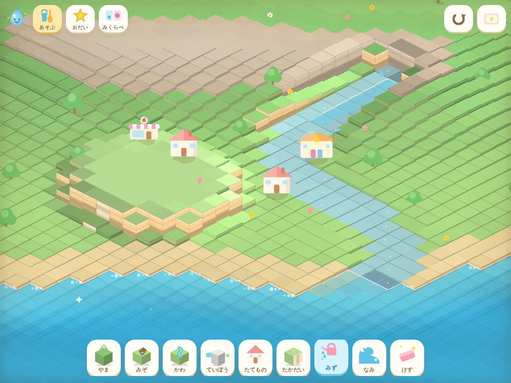
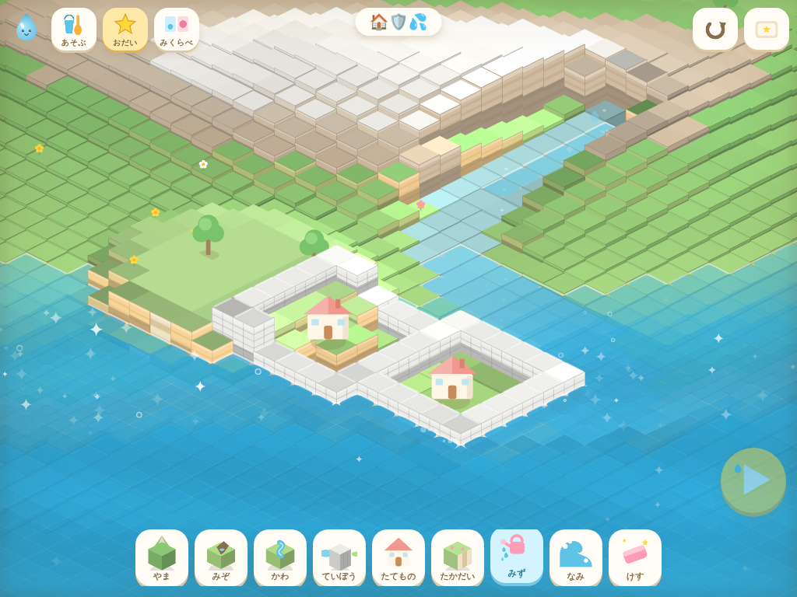

# みずみちラボ 💧

4歳児向けの、タッチ操作中心の「水の流れであそぶ」箱庭シミュレーションゲームです。
海辺の町のミニチュア模型に、山・溝・川・堤防・建物・高台を置いたり動かしたりして、
**水がどこへ流れていくのか** を何度でも試して観察できます。

防災教育のエッセンス(水は低いところへ流れる / 堤防でせき止められる / 高い場所には届きにくい)を、
説明文ではなく **ジオラマ遊びの体験そのもの** で伝えることを目指しています。
怖い演出・破壊表現はありません。

| 海辺の町の模型 | 堤防でおうちを守れた! |
|---|---|
|  |  |

## あそびかた

ブラウザで `index.html` を開くだけで遊べます(ビルド不要・依存ライブラリなし)。
iPad / iPhone の Safari でのタッチ操作を想定していますが、PC のマウスでも遊べます。

ローカルサーバーを使う場合:

```bash
python3 -m http.server 8000
# → http://localhost:8000 を開く
```

### モード

| モード | 内容 |
|---|---|
| 🪣 あそぶ | 自由に地形を作って水を流す、メインの箱庭モード |
| ⭐ おだい | 「おうちをぬらさないように」「たかだいをまもろう」「かわのみずをうみへ」の3つのおだい |
| 📷 みくらべ | 水の広がりを「おぼえて」、町を変えたあとの流れとピンクの点線で見くらべる |

### ツール(画面下のボタン)

- **やま** — 押している間、こんもり山が育つ
- **みぞ** — 指でなぞって細い溝を掘る
- **かわ** — 広めに掘って水色の川底を作る
- **ていぼう** — なぞった場所に白い壁が立つ
- **たてもの** — おうち / おみせ / ほいくえん を置く・ドラッグで移動
- **たかだい** — 階段つきの平らな高台を作る
- **みず** — 押している場所に水を注ぐ
- **なみ** — 海から大きな(でもやさしい)波がくる
- **けす** — 最初の地形に戻す・置いたものを消す

上部の ↺ でひとつ前に戻す、⭐ボタン横のリセットで最初からやり直せます。

## しくみ

- 素の HTML5 + Canvas 2D。`file://` でもそのまま動くよう、ES modules を使わずグローバル名前空間で構成
- 地形は **52×52** のハイトマップ。描画は **真アイソメ投影**(ひし形グリッド、2:1)。
  格子点 (gx, gy) と高さ h を `px = ox + (gx-gy)*tw/2`, `py = oy + (gx+gy)*th/2 - h*eh` でスクリーン座標に変換し、
  各セルを対角線 `s = x+y` の昇順(奥→手前)に描くことで奥行きの前後関係を出す。
  1マスは「上面(ひし形)+右面+左面」の3面ブロックとして描き、段差をそのまま壁として表現するジオラマ表現。
  グリッドは奥の頂点側が山なみ、手前の頂点側が海という対角線構図になっている
- 机やトレイ、菱形の盤といった枠は廃止し、**カバー型の全画面ビュー**にした。ワールド菱形が画面の四隅まで完全に覆うよう拡大率を決め、
  画面矩形に収まるセルだけをアクティブ領域として描画・シミュレーション・タッチ判定の対象にする(画面外のセルは地形としては存在するが処理をスキップする)。
  外周には額縁のようなごく薄い内側の影(ビネット)だけが残る
- モード切り替え・ツールバー・もどす/リセットなどの UI はすべて `#stage` 内にフローティング配置され、固定のバー領域は持たない
- 詳しい設計は [docs/FULLSCREEN_SPEC.md](docs/FULLSCREEN_SPEC.md) を参照
- 水はセルオートマトン(表面高の低い隣へ流す)による簡易流体。海はイベント時に水位が上下する固定水源
- 効果音は WebAudio でリアルタイム合成、音声は SpeechSynthesis(ja-JP)。音声アセット不要

## ファイル構成

```
index.html        エントリ・DOM構造
css/style.css     レイアウト・ボタン・カード
js/config.js      定数・パレット・ユーティリティ
js/audio.js       効果音(WebAudio合成)と音声よみあげ
js/terrain.js     ハイトマップ・マップ生成・編集ツール・undo
js/water.js       水シミュレーション・大波イベント・ぬれ判定
js/entities.js    建物/木/花/舟の描画
js/particles.js   きらきら・あわ・しぶき・花びら
js/iso.js         真アイソメ投影・当たり判定API(project/pick など)
js/render.js      ジオラマ描画(真アイソメ・壁面・なぎさ)
js/water_render.js 水のひし形描画(水面・段差の滝・きらきら)
js/icons.js       ボタンアイコン(ミニチュアを直接描画)
js/mascot.js      マスコット「ぷるちゃん」
js/modes.js       モード管理・おだい定義と判定・みくらべ
js/input.js       タッチ入力・ツール適用
js/main.js        起動・メインループ・タイトル画面
```

## 拡張のしかた

- **おだいの追加**: `js/modes.js` の `QUESTS` 配列にエントリを足す。
  マップは `js/terrain.js` の `genMap(variant)` に variant を追加して定義
- **建物の種類追加**: `js/entities.js` に描画関数、`js/icons.js` にアイコン、
  `index.html` のサブパレットにボタンを足す
- **パーツの追加**(橋・道路・公園など): `js/terrain.js` にツール関数を作り、
  `js/input.js` の `applyTool` と `index.html` のツールバーに登録する
