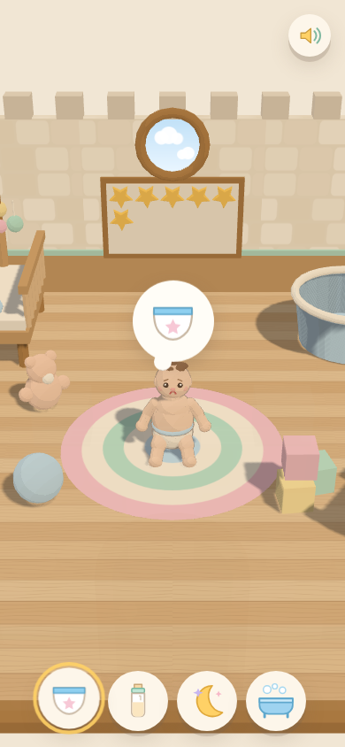
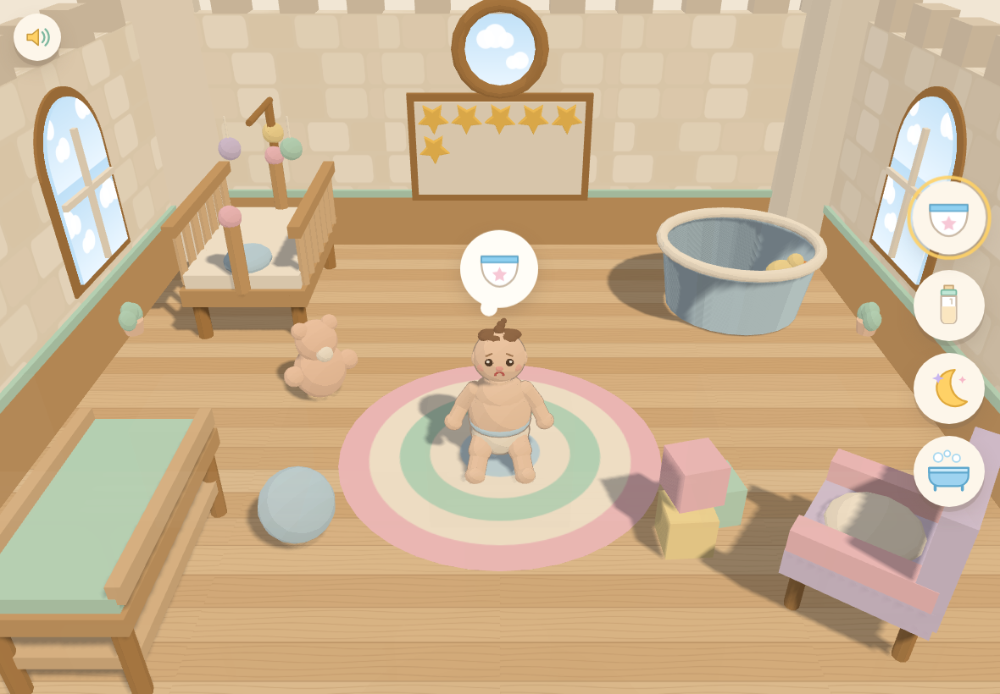

# あかちゃんのおうち（Baby Care Game）

4さいのおともだちが、iPad / iPhone のたて画面・よこ画面で あそべる 赤ちゃんのお世話ゲームです。
お城のかたちをした ベビーハウスで、おむつ・ミルク・ねんね・おふろ の 4つのお世話をします。

- **失敗もゲームオーバーもありません。** できることは「お世話する」「なでる」「カメラを動かす」だけ。
- **文字は 1つも出しません。** 操作はぜんぶ 絵アイコンと、指の動きのお手本アニメで伝えます。
- **ビルド不要。** three.js を CDN から読み込むだけの、ふつうの HTML です（通信できないときは同梱コピーに自動で切り替わります）。

| たて画面（iPhone） | よこ画面（iPad） |
|---|---|
|  |  |

## あそびかた

| アイコン | お世話 | 指の動き |
|---|---|---|
| おむつ | おむつ交換 | よごれたおむつを **下へひっぱる** |
| ほにゅうびん | ミルク | びんを **おくちまで運ぶ**（近づけば自動でくっつきます） |
| つき | ねんね | おふとんの上を **左右になでなで** |
| おふろ | おふろ | スポンジで **からだをごしごし** |

そのほかの操作:

- **1本ゆびでドラッグ** … カメラがぐるっと回ります
- **2本ゆびでピンチ** … よったり ひいたり
- **赤ちゃんをタップ** … くすぐると わらいます
- **左上（よこ画面は左上）のスピーカー** … 音のオン／オフ
- **もどるボタン（←）** … お世話をとちゅうでやめる

お世話をすると、おくの かべのボードに **ほしシール** が 1まいずつ増えていきます。
シールと お世話のぐあいは、その端末に自動で保存されます（`localStorage`）。

赤ちゃんは じかんが たつと、おむつ・ミルク・ねんね・おふろ を したがります。
そのときは あたまの上にフキダシが出て、下（よこ画面では右）のボタンが ぴょんと跳ねます。
ほうっておいても 泣きつづけたり ゲームオーバーになったりはしません。

## うごかしかた

ES モジュールを使っているので、`index.html` をダブルクリックして開く（`file://`）のではなく、
かんたんなサーバー経由で開いてください。

```bash
cd baby-care-game
python3 -m http.server 8000
# → ブラウザで http://localhost:8000/ をひらく
```

同じ Wi-Fi の iPad から遊ぶときは、PC の IP アドレスで `http://192.168.x.x:8000/` を開きます。

### GitHub Pages で公開する（iPad で遊ぶならこれが簡単）

1. このリポジトリの **Settings → Pages** をひらく
2. **Source** に `Deploy from a branch` を選び、公開したいブランチと `/ (root)` を指定
3. 数分後に `https://<ユーザー名>.github.io/<リポジトリ名>/baby-care-game/` で遊べます
4. iPad の Safari で開いて「ホーム画面に追加」すると、全画面のアプリのように起動します

## ファイル構成

```
baby-care-game/
├── index.html            エントリ。three.js の読み込み先を決めてから起動する
├── vendor/three.module.js CDN が使えないときのための同梱コピー（r161）
├── docs/design.md        設計メモ
└── src/
    ├── main.js           全体の組み立てとメインループ
    ├── scene/            部屋・家具・照明・模様・演出の粒
    │   ├── room.js       お城風の壁、窓、塔（手前の壁は自動で透ける）
    │   ├── props.js      ベビーベッド／バスタブ／おむつ台／いす／ごほうびボード
    │   ├── palette.js    色見本とトゥーン素材
    │   ├── textures.js   木目・石積みなどを canvas で生成
    │   ├── lighting.js   ひるとよるの明かり
    │   └── particles.js  きらきら・あわ・ハート
    ├── baby/baby.js      赤ちゃん本体（4頭身モデル・表情・ポーズ・アニメ）
    ├── camera/cameraRig.js 自由カメラ＋場面ごとの自動フレーミング
    ├── care/             お世話 4種（base.js が共通のかたち）
    ├── ui/               HUD・アイコン・入力のふりわけ・スタイル
    ├── state/gameState.js 欲求としあわせ度、セーブデータ
    └── audio/sfx.js      効果音（Web Audio でその場で合成）
```

## 保護者・開発者むけメモ

- 音は Web Audio API で合成しています。iOS では最初に画面をさわるまで音が鳴りません（仕様です）。
- 対応ブラウザ: iOS 16.4 以降の Safari、および最近の Chrome / Edge / Firefox（`importmap` と WebGL を使用）。
- 保存データを消したいときは、ブラウザのサイトデータを削除してください。
