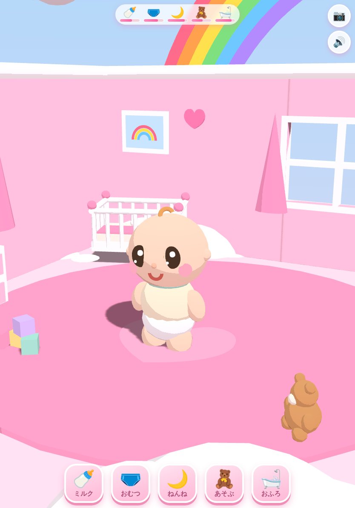

# 🌈 にじのおうちの あかちゃん

4歳のお子さま向けの **赤ちゃん育成ゲーム** です。
雲の上に浮かぶ虹のファンタジーハウスで、超デフォルメ（約2頭身）のトゥーン調 3D 赤ちゃんのお世話をします。
iPad / iPhone の **縦画面・横画面どちらでも** 遊べます。



## あそびかた

文字が読めなくても遊べるよう、操作はすべて **大きなアイコンボタン** と **ふきだし** で伝わるようにしています。

1. 「はじめる ▶」をタップすると、空のおうちへズームインしてゲームが始まります。
2. 画面上部のメーターが減って、赤ちゃんが泣き出すと、頭の上に「ほしい物」のふきだし（🍼 など）が出ます。
   対応する下のボタンが**ぴょんぴょん光って**教えてくれます。
3. ボタンをタップしてお世話をすると、ハートがはじけてチャイムが鳴り、赤ちゃんがよろこびます。

| ボタン | お世話 | 演出 |
|---|---|---|
| 🍼 ミルク | ミルクをあげる | ごくごく音・びんのミルクが減る・げっぷ |
| 🩲 おむつ | おむつをかえる | ポフッと煙 → キラキラで新品に |
| 🌙 ねんね | ねんねさせる | 部屋が夜になり、オルゴールの子守唄と Zzz |
| 🧸 あそぶ | ガラガラであそぶ | 音符が飛んで笑い声 |
| 🛁 おふろ | あわあわで洗う | あわ・あひるちゃん・スポンジがくるくる |

- **赤ちゃんを直接タップ**すると、こちょこちょして笑います（ごきげんが少し回復）。
- **カメラは自由**：1本指ドラッグで回転、ピンチでズーム（マウスならドラッグ＋ホイール）。📷 ボタンでいつでも赤ちゃんのアップに戻ります。
- 🔊 ボタンで音のオン・オフ。
- 失敗やゲームオーバーはありません。ほうっておいても赤ちゃんが泣くだけで、お世話すればすぐ仲直りです。
- メーターの状態は自動保存され、次に開いたときに続きから遊べます。

## 起動方法

ビルド不要・完全オフライン動作（Three.js 同梱）です。

```bash
cd baby-raising-game
python3 -m http.server 8000
# → ブラウザ / iPad の Safari で http://<マシンのIP>:8000 を開く
```

`index.html` をブラウザで直接開いても動作します（`file://` 可）。
iPad / iPhone では Safari の「ホーム画面に追加」でフルスクリーンのアプリとして遊べます。

## 仕様（デザイン選択）との対応

| 項目 | 選択 | 実装 |
|---|---|---|
| 表現形式 | しっかり3D | Three.js（WebGL）によるリアルタイム3D・影つき |
| 絵柄 | 漫画寄り | トゥーンシェーディング＋丸顔・大きな目・単純な形 |
| 頭身 | 超デフォルメ（2〜2.5頭身） | 頭が全身の約半分のプロポーション |
| 家の外観 | 虹と雲のファンタジーハウス | 雲の島に浮かぶ家、背後に大きな虹、流れる雲、開始時に外から家へズームイン |
| 室内の色調 | ピンク中心 | 壁・床・家具・UI までピンクのパステルパレット |
| 部屋構成 | 1部屋完結 | ベビーベッド・タンス・おもちゃ箱のあるワンルーム |
| カメラ | 自由に動くカメラ | OrbitControls（回転・ズーム、タッチ対応）＋リセットボタン |
| 距離感 | アップ中心 | 既定カメラは赤ちゃんのクローズアップ。演出も顔まわり中心 |

## フォルダ構成

```
baby-raising-game/
├── index.html          # エントリーポイント（UI の DOM もここ）
├── css/
│   └── style.css       # HUD・ボタン・スタート画面のスタイル
├── js/
│   ├── sfx.js          # WebAudio 効果音・子守唄・BGM（全部その場で合成）
│   ├── world.js        # 空・虹・雲・お部屋・家具の 3D シーン
│   ├── baby.js         # 赤ちゃんモデルと表情・アニメーション
│   └── game.js         # ゲームループ・お世話・メーター・カメラ・保存
├── lib/
│   ├── three.min.js    # Three.js r128（同梱・オフライン動作用）
│   └── OrbitControls.js
├── assets/
│   └── icon.png        # favicon / ホーム画面アイコン
└── docs/
    └── screenshots/    # 動作確認スクリーンショット
```

## 技術メモ

- 3D モデルはすべてプリミティブ（球・トーラス・ボックス等）をコードで組み立てており、外部アセットはありません。
- 音は WebAudio API で合成（音声ファイルなし）。iOS の制約に合わせ、最初のタップで AudioContext を解錠します。
- 泣き声はやさしい音量の「ふぇ〜ん」、お世話成功でチャイム、ねんね中は「きらきら星」のオルゴールが流れます。
- セーブは `localStorage`。ゲームを閉じている間のメーター減少は最大5分ぶんに制限し、再開時に必ず遊べる状態にしています。
